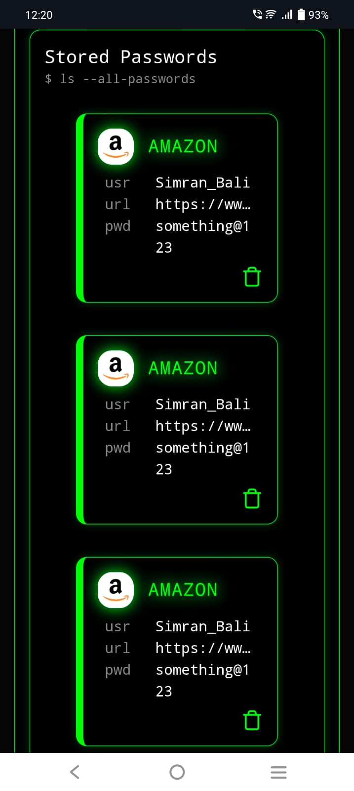

# VaultWise


VaultWise is a high-performance, terminal-inspired password management interface designed for developers and security enthusiasts. Featuring a "Cyber-Shell" aesthetic, it provides a streamlined workflow for managing digital credentials with a Matrix-green terminal UI.

[](https://react.dev/)
[](https://vitejs.dev/)
[](https://tailwindcss.com/)
[](LICENSE)

## 🚀 Overview

VaultWise transforms the mundane task of password management into a terminal-like experience. Built with **React 19** and **Tailwind CSS 4**, it offers a lightning-fast, responsive interface that mimics a secure shell environment (`SECURE_SHELL v4.1.6`).

### 📸 Visuals

| Desktop View | Mobile View |
| :---: | :---: |
|  |   |

- **Target Audience**: Developers, SysAdmins, and users who prefer CLI-inspired aesthetics.
- **Status**: Alpha (UI/UX Prototype)
## ✨ Features

- **Terminal UI/UX**: Authentic monospace aesthetic with "Matrix Green" accents and terminal-style command prompts.
- **Credential Injection**: Dedicated interface for adding new records including site names, user identifiers, target URLs, and passkeys.
- **Vault Listing**: A grid-based view of stored credentials with quick-access cards.
- **Grep Search**: Integrated search bar styled as a `grep` command for rapid credential filtering.
- **Responsive Design**: Fully optimized for both desktop "workstations" and mobile "handhelds."
- **Visual Feedback**: Hover effects, glowing shadows, and terminal cursors for an immersive experience.

## 🛠 Tech Stack

- **Framework**: [React 19](https://react.dev/)
- **Build Tool**: [Vite 8](https://vitejs.dev/)
- **Styling**: [Tailwind CSS 4](https://tailwindcss.com/) (using the new `@tailwindcss/vite` plugin)
- **Icons**: [Lucide React](https://lucide.dev/)
- **Linting**: ESLint 10

## 📂 Architecture

```text
src/
├── components/
│   ├── navbar.jsx          # Branding, terminal status, and search grep
│   ├── leftContent.jsx     # Layout wrapper for credential input
│   ├── rightContent.jsx    # Layout wrapper for the password vault grid
│   ├── newCredentials.jsx  # Form for "Injecting" new records
│   ├── passwordCard.jsx    # Individual credential display component
│   └── ...
├── App.jsx                 # Main application shell and layout logic
└── main.jsx                # Application entry point
```

## 🏁 Getting Started

### Prerequisites

- **Node.js**: `v18.0.0` or higher
- **npm**: `v9.0.0` or higher

### Installation

1. **Clone the repository**
   ```bash
   git clone https://github.com/simranbali-ace04/VaultWise.git
   cd VaultWise
   ```

2. **Install dependencies**
   ```bash
   npm install
   ```

3. **Launch development server**
   ```bash
   npm run dev
   ```

4. **Build for production**
   ```bash
   npm run build
   ```

## 📖 Usage

### Adding Credentials
1. Navigate to the **NEW_CREDENTIAL.sh** panel on the left.
2. Enter the `SITE_NAME`, `USER_IDENT`, `TARGET_URL`, and `PASSKEY`.
3. Click the `[ COMMIT ]` button to save the record to the vault.

### Searching
Use the terminal input in the top right corner:
```bash
grep -i query...
```
Type your search term to filter through your stored credentials instantly.

### Deleting Records
Each password card features a `Trash` icon. Clicking this will remove the credential from the active session.

## 🔧 Configuration

The project uses Tailwind CSS 4. Configuration is primarily handled via CSS variables and the Vite plugin in `vite.config.js`.

```javascript
// vite.config.js
import { defineConfig } from 'vite'
import react from '@vitejs/plugin-react'
import tailwindcss from '@tailwindcss/vite'

export default defineConfig({
  plugins: [
    react(),
    tailwindcss(),
  ],
})
```

## 🗺 Roadmap

- [ ] **Persistence**: Implement LocalStorage or MongoDB integration.
- [ ] **Encryption**: Add AES-256 client-side encryption for passkeys.
- [ ] **Password Generator**: Add a `pwgen` style utility for creating secure passwords.
- [ ] **Copy to Clipboard**: One-click copy for usernames and passwords.
- [ ] **Auth**: Implement a master-password login screen.

## 🤝 Contributing

Contributions are welcome! Please follow these steps:

1. Fork the Project
2. Create your Feature Branch (`git checkout -b feature/AmazingFeature`)
3. Commit your Changes (`git commit -m 'Add some AmazingFeature'`)
4. Push to the Branch (`git push origin feature/AmazingFeature`)
5. Open a Pull Request

## 📄 License

Distributed under the MIT License. See `LICENSE` for more information.

## 📞 Support

- **Issue Tracker**: [Report Bugs](https://github.com/simranbali-ace04/VaultWise/issues)
- **Project Link**: [https://github.com/simranbali-ace04/VaultWise](https://github.com/simranbali-ace04/VaultWise)

---
**root@vault:~$** logout
*Connection closed.*