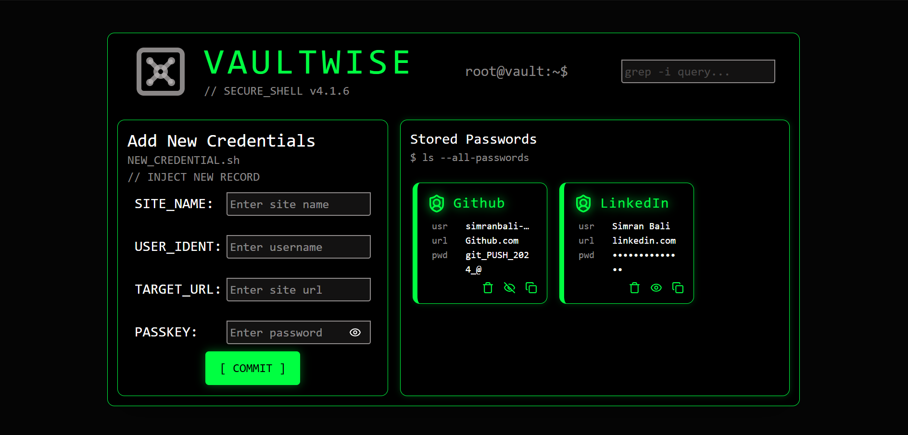
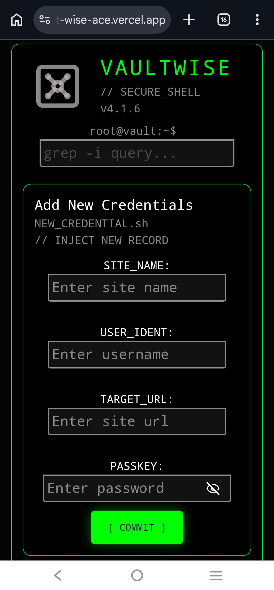
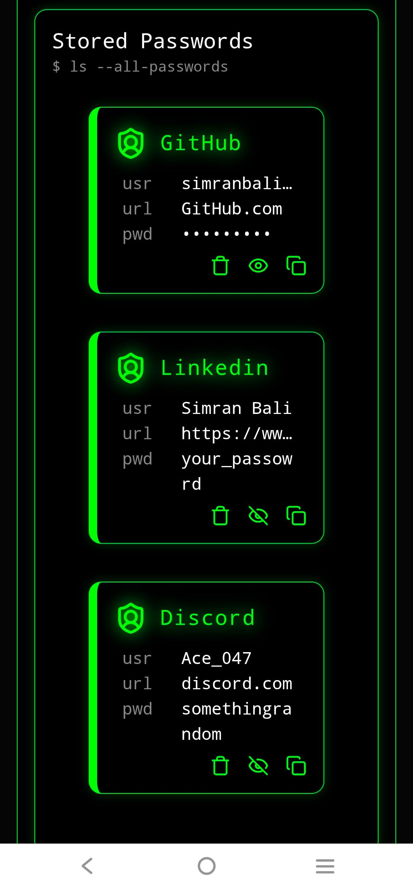

<div align="center">

<pre>
██╗   ██╗ █████╗ ██╗   ██╗██╗  ████████╗██╗    ██╗██╗███████╗███████╗
██║   ██║██╔══██╗██║   ██║██║  ╚══██╔══╝██║    ██║██║██╔════╝██╔════╝
██║   ██║███████║██║   ██║██║     ██║   ██║ █╗ ██║██║███████╗█████╗  
╚██╗ ██╔╝██╔══██║██║   ██║██║     ██║   ██║███╗██║██║╚════██║██╔══╝  
 ╚████╔╝ ██║  ██║╚██████╔╝███████╗██║   ╚███╔███╔╝██║███████║███████╗
  ╚═══╝  ╚═╝  ╚═╝ ╚═════╝ ╚══════╝╚═╝    ╚══╝╚══╝ ╚═╝╚══════╝╚══════╝
</pre>

### your credentials. your browser. your vault.

<br />

[](https://vault-wise-ace.vercel.app/)
&nbsp;

&nbsp;

&nbsp;


</div>

<br />

---

## 💡 Why this exists

I got tired of forgetting passwords. Tired of the *"forgot password"* loop at 2am. Tired of reusing the same one everywhere like a disaster waiting to happen.

I didn't want to hand my credentials to some cloud app I barely trust. I didn't want a subscription. I just wanted something that works — offline, in my browser, no account, no nonsense.

So I built **VaultWise** — a terminal-inspired, Cyber-Shell password manager that lives entirely in your browser. Matrix-green aesthetic, zero backend, everything stored locally. Built because sometimes you just build the thing yourself.

---

## ✅ Features

| Feature | Status |
|---|---|
| Fully responsive UI — mobile to widescreen | ✅ Shipped |
| Save site, username & password to the vault | ✅ Shipped |
| Show / hide passwords on demand | ✅ Shipped |
| Copy credentials to clipboard | ✅ Shipped |
| Delete records | ✅ Shipped |
| localStorage persistence — stays in your browser, never leaves | ✅ Shipped |

---

## 📸 Screenshots

**Desktop**

<p align="left">
  
</p>

<br />

**Mobile**

<p align="left">
  
  &nbsp;&nbsp;&nbsp;
  
</p>

---

## 📂 Project Structure

```
src/
├── components/
│   ├── navbar.jsx           # Branding and terminal status indicator
│   ├── leftContent.jsx      # Layout wrapper for credential input
│   ├── rightContent.jsx     # Layout wrapper for the vault grid
│   ├── newCredentials.jsx   # Form for adding new records
│   ├── passwordCard.jsx     # Individual credential card
│   └── ...
├── App.jsx                  # Main shell and layout logic
└── main.jsx                 # Entry point
```

---

## 🚀 Getting Started

**Prerequisites:** Node.js `v18+` and npm `v9+`

**1. Clone the repo**
```bash
git clone https://github.com/simranbali-ace04/VaultWise.git
cd VaultWise
```

**2. Install dependencies**
```bash
npm install
```

**3. Start the dev server**
```bash
npm run dev
```

**4. Build for production**
```bash
npm run build
```

---

## 🧰 Tech Stack

| Tech | Role |
|---|---|
| React 19 | UI components |
| Vite | Build tool |
| Tailwind CSS v4 | Styling |
| lucide-react | Icons |
| localStorage | Client-side persistence |
| Vercel | Deployment |

---

## ⚠️ Heads Up

Passwords are currently stored as **plaintext in localStorage.** This is a personal tool — it does exactly what it needs to. Don't vault your bank login just yet. 🫡

---

<div align="center">

<br />

built by [Simran Bali](https://github.com/simranbali-ace04) — because sometimes you just build the thing yourself.

</div>
