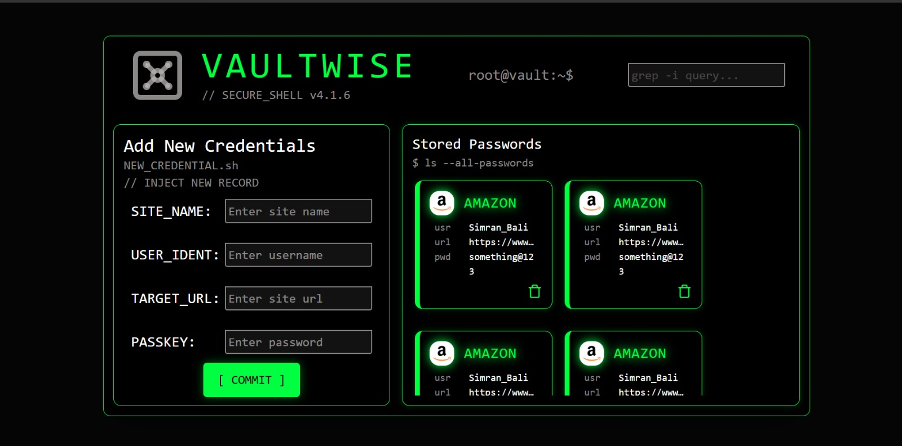
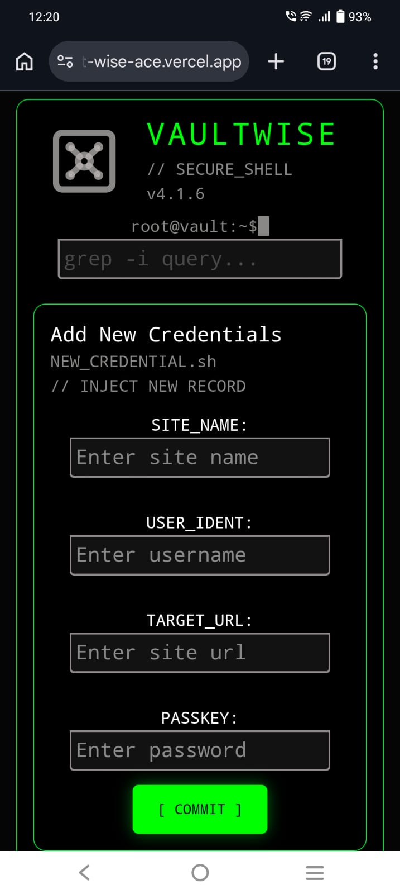

<div align="center">

```
██╗   ██╗ █████╗ ██╗   ██╗██╗  ████████╗██╗    ██╗██╗███████╗███████╗
██║   ██║██╔══██╗██║   ██║██║  ╚══██╔══╝██║    ██║██║██╔════╝██╔════╝
██║   ██║███████║██║   ██║██║     ██║   ██║ █╗ ██║██║███████╗█████╗  
╚██╗ ██╔╝██╔══██║██║   ██║██║     ██║   ██║███╗██║██║╚════██║██╔══╝  
 ╚████╔╝ ██║  ██║╚██████╔╝███████╗██║   ╚███╔███╔╝██║███████║███████╗
  ╚═══╝  ╚═╝  ╚═╝ ╚═════╝ ╚══════╝╚═╝    ╚══╝╚══╝ ╚═╝╚══════╝╚══════╝
```

**your credentials. your browser. your vault.**

[](https://vault-wise-ace.vercel.app/)


</div>

---

## Why this exists

I got tired of forgetting passwords. Tired of the "forgot password" loop at 2am. Tired of reusing the same one everywhere like a disaster waiting to happen.

I didn't want to hand my credentials to some cloud app I barely trust. I didn't want a subscription. I just wanted something that works — offline, in my browser, no account, no nonsense.

So I built VaultWise. A terminal-inspired, Cyber-Shell password manager that lives entirely in your browser. Matrix-green aesthetic, zero backend, everything stored locally. Built because sometimes you just build the thing yourself.

---

## What's built so far

> 🚧 Actively in progress — UI is fully done and responsive. Logic is being wired up.

```
[✓]  Fully responsive UI — looks clean from mobile to widescreen
[~]  Save site, username & password to the vault
[~]  Show / hide passwords on demand
[~]  Copy credentials to clipboard
[~]  Delete records
[~]  localStorage persistence — stays in your browser, never leaves
```

`[✓] shipped  ·  [~] in progress`

---

### Screenshots

**Desktop**
<p align="left">
  
</p>

**Mobile**
<p align="left">
  
  &nbsp;&nbsp;
  
</p>

---

## Project structure

```
src/
├── components/
│   ├── navbar.jsx           # Branding, terminal status indicator
│   ├── leftContent.jsx      # Layout wrapper for credential input
│   ├── rightContent.jsx     # Layout wrapper for the vault grid
│   ├── newCredentials.jsx   # Form for adding new records
│   ├── passwordCard.jsx     # Individual credential card
│   └── ...
├── App.jsx                  # Main shell and layout logic
└── main.jsx                 # Entry point
```

---

## Getting started

**You'll need:** Node.js `v18+` and npm `v9+`

```bash
git clone https://github.com/simranbali-ace04/VaultWise.git
cd VaultWise
npm install
npm run dev
```

```bash
npm run build    # production build
```

---

## Stack

`React 19` · `Vite` · `Tailwind v4` · `lucide-react` · `localStorage` · `Vercel`

---

## Heads up

Passwords are stored as **plaintext in localStorage** for now — it's a personal tool under active development. Encryption is coming. Don't vault your bank login just yet. 🫡

---

<div align="center">
built by <a href="https://github.com/simranbali-ace04">Simran Bali</a>
</div>
